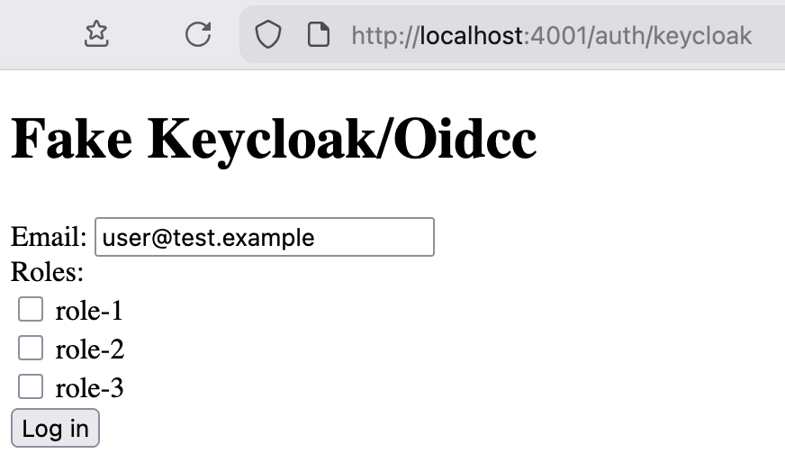

# UeberauthFakeOidcc

An implementation of [Ueberauth.Strategy](https://hexdocs.pm/ueberauth/Ueberauth.Strategy.html) for use in development environments, which allows specifying email and roles on each login.



## Installation

```elixir
# mix.exs
def deps do
  [
    {:ueberauth_fake_oidcc, github: "skyqrose/ueberauth_fake_oidcc", tag: "v0.1.0", only: [:dev, :test]},
  ]
end

# config/dev.exs and config/test.exs
config :ueberauth, Ueberauth,
  providers: [
    keycloak: {Ueberauth.Strategy.FakeOidcc, [
      roles: [
        "role1",
        "role2",
      ]
    ]}
  ]
```

Options that control the log in form:
- `callback_path`: String path for the callback url. Default `"/auth/#{provider}/callback"`
- `initial_email`: String initial value for the email input. Default `"user@test.example"`.
- `roles`: List of string role names that can be chosen during login. Default `[]`.

Options that control the auth data returned:
- `client_id`: String client id. Default `"fake_client_id"`.
- `credentials`: Map, a partial of `Ueberauth.Auth.Credentials`. Default `%{}`. Any values here will override default values in the returned credentials.
- `ttl`: TTL in seconds for the credential. Default `9 * 60 * 60`.
- `uid`: String value to set in `auth.uid`. Default `"fake_uid"`.
- `userinfo`: Map of fields to include in `auth.extra.userinfo`. Default `%{}`. Don't use the key `"roles"` or `"resource_access"`, since FakeOidcc sets those based on user input.

Selected roles are added to the ueberauth result in two places:
```ex
%Ueberauth.Auth{
  extra: %Ueberauth.Auth.Extra{
    raw_info: %{
      userinfo: %{
        "resource_access" => %{
          client_id => %{"roles" => roles}
        },
        "roles" => roles,
      }
    }
  }
}
```
