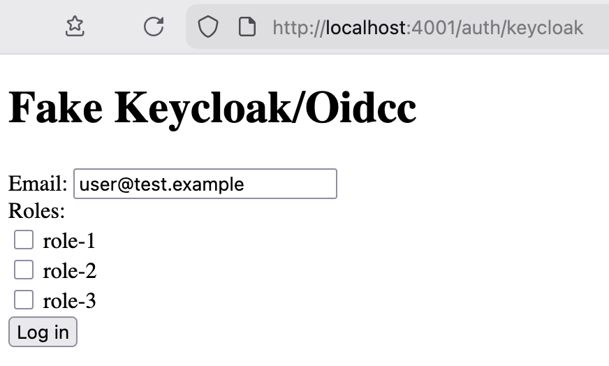

# UeberauthFakeOidcc

An implementation of [Ueberauth.Strategy](https://hexdocs.pm/ueberauth/Ueberauth.Strategy.html) for use in development environments, which allows specifying email and roles on each login.



In order to fit the different ways that apps tend to use OIDCC, there are some configuration options. However, this library does not attempt to accurately mimic all of the features and configurability of OIDCC. If there's a feature you need that's missing, open an issue.

## Installation

```elixir
# mix.exs
def deps do
  [
    {:ueberauth_fake_oidcc, github: "skyqrose/ueberauth_fake_oidcc", tag: "v0.1.2", only: [:dev, :test]},
  ]
end

# config/dev.exs and config/test.exs
config :ueberauth, Ueberauth,
  providers: [
    keycloak: {Ueberauth.Strategy.FakeOidcc, [
      roles: [
        "role1",
        "role2",
      ]
    ]}
  ]
```

Options that control the log in form:
- `auto_redirect`: Skip the login form and redirect immediately with the default email and all roles selected. Default `false`.
- `callback_path`: String path for the callback url. Default `"/auth/#{provider}/callback"`
- `initial_email`: String initial value for the email input. Default `"user@test.example"`.
- `roles`: List of string role names that can be chosen during login. Default `[]`.

Options that control the auth data returned by the callback:
- `client_id`: String client id. Default `"fake_client_id"`.
- `credentials`: Map, a partial of `Ueberauth.Auth.Credentials`. Default `%{}`. Any values here will override default values in the returned credentials.
- `info`: Map, a paartial of `Ueberauth.Auth.Info`. Default %{}. Values to include in `auth.info`. Don't use the key `:email`, since FakeOidcc sets it based on user input.
- `ttl`: TTL in seconds for the credential. Default `9 * 60 * 60`.
- `uid`: String value to set in `auth.uid`. Default `"fake_uid"`.
- `userinfo`: Map of fields to include in `auth.extra.userinfo`. Default `%{}`. Don't use the key `"roles"` or `"resource_access"`, since FakeOidcc sets those based on user input.

The data returned by the callback looks like:

```ex
%Plug.Conn{
  assigns: %{
    ueberauth_auth: %Ueberauth.Auth{
      uid: "fake_uid",
      provider: (provider),
      strategy: Ueberauth.Strategy.FakeOidcc,
      info: %Ueberauth.Auth.Info{
        email: "user@test.example"
        # (plus any fields specified by config info)
      },
      credentials: %Ueberauth.Auth.Credentials{
        token: "fake_access_token",
        refresh_token: "fake_refresh_token",
        token_type: "Bearer",
        expires: true,
        expires_at: (unix timestamp based on config ttl)
        # (plus any fields specified by config `credentials`)
      },
      extra: %Ueberauth.Auth.Extra{
        raw_info: %UeberauthOidcc.RawInfo{
          claims: %{
            "auth_time" => (unix_timestamp),
            "iat" => (unix_timestamp),
            "sub" => "fake_uid"
          },
          userinfo: %{
            "resource_access" => %{
              "fake_client_id" => %{"roles" => (roles_list)}
            },
            "roles" => (roles_list)
            # (plus any fields specifed by config `userinfo`)
          }
        }
      }
    }
  }
}
```
